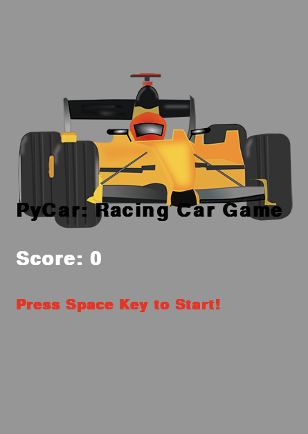
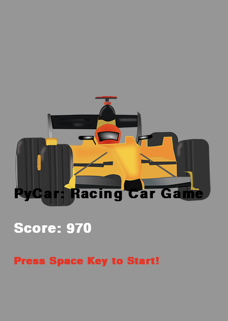

# PyAboidCarRacing

### 개요
 
  -  파이레이싱 게임
  -  2022.01.10 - 2022.01.11(제작기간)

### 사용한 라이브러리
  - pygame library
   ```python
    import pygame
    import random
    from time import sleep
   ```
### 로직
  - 게임창 크기 및 RGB값 설정
  - 랜덤하게 나올 차 이미지, 게임 유저의 위치, 차 위치 초기화
  - 유저가 화면에서 벗어나는 것을 막음 & 차가 서로 충돌했을 때
  - 게임이 실행됨 --> 초기화
  - 차 랜덤하게 등장 --> 최소 3대가 움직인다고 보면 됨
  - 게임이 실행될 때마다 차선이 등장
  - 만일 차들끼리 서로 충돌했다면 점수 --> 초기화 --> 5초 있다가 다시 실행
  - 충돌을 하지 않는다면 키보드 방향키에 따라 움직일 수 있음 --> 현재 x좌표로만 설정했으나 후에 y좌표 역시 움직이는 것으로 설정해 놓겠음
  - 만일 키보드를 누르지 않으면 한 방향 그대로 차가 움직임
